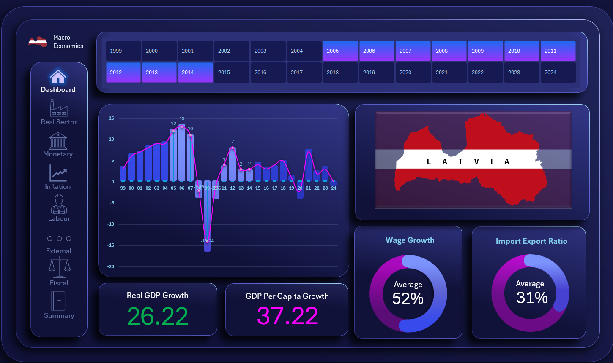
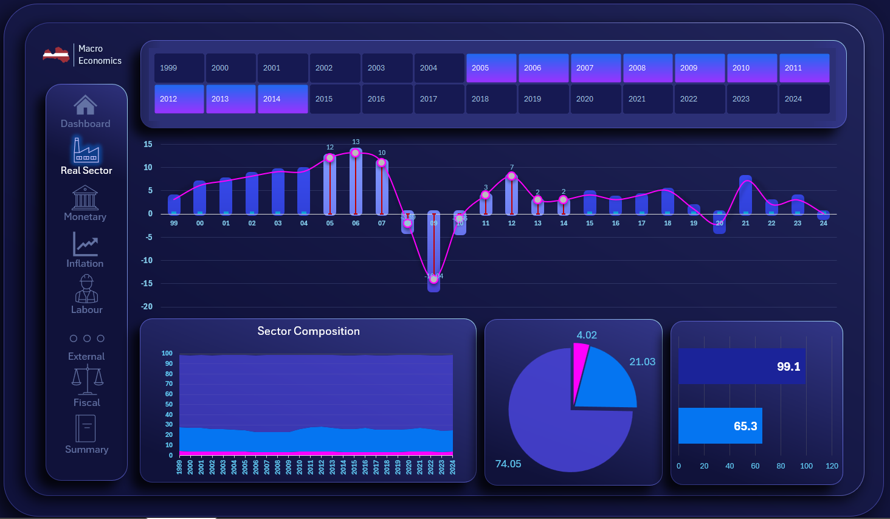
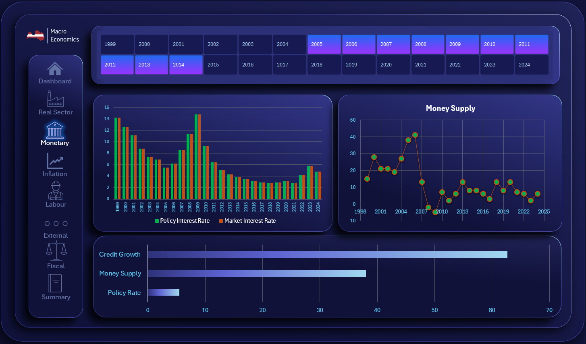
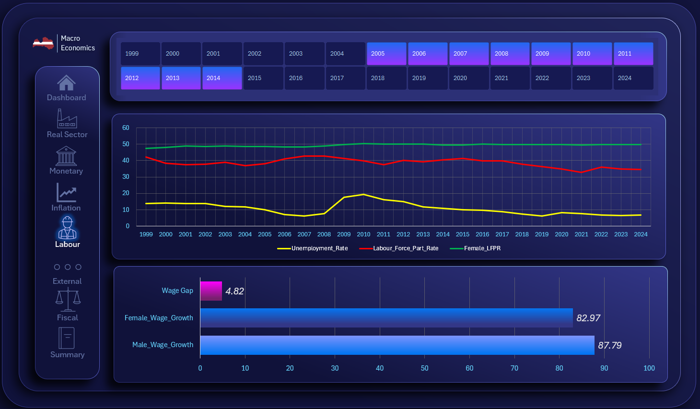
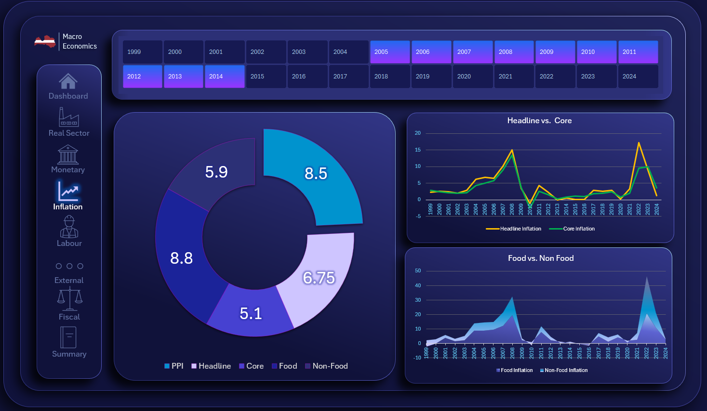
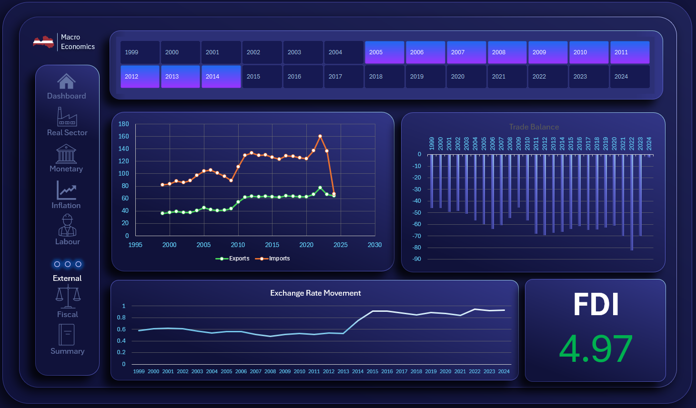
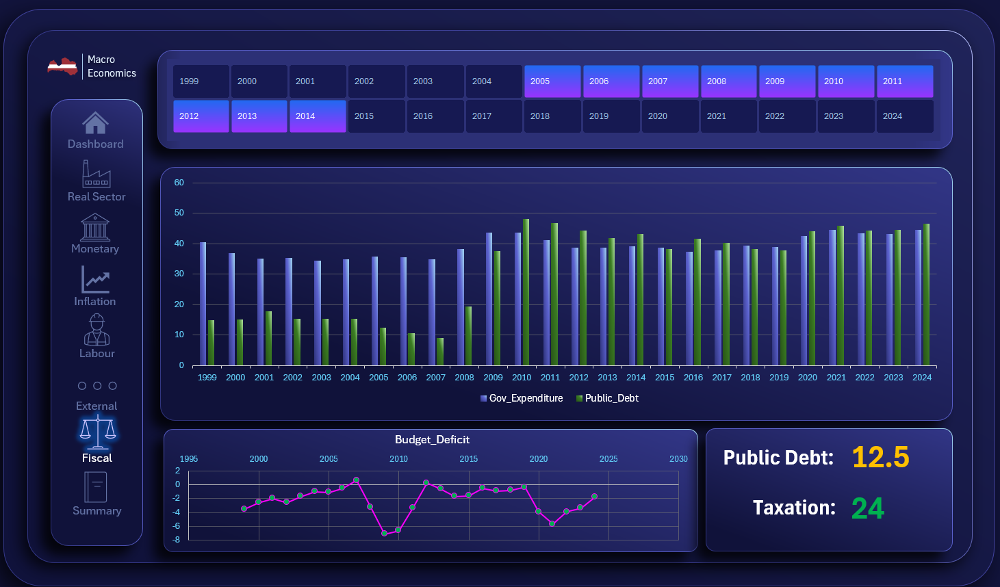
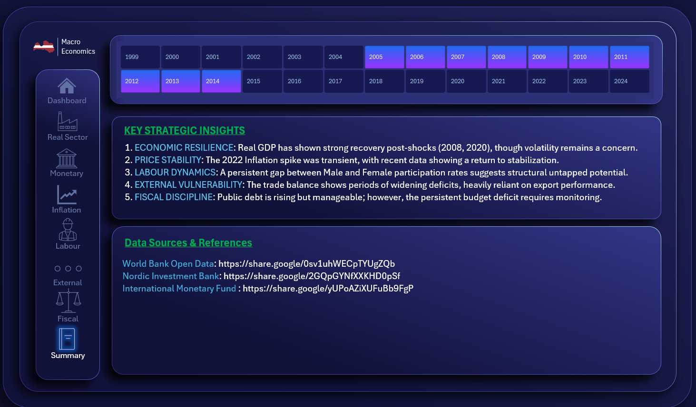

**Latvia Macroeconomic Performance Dashboard (1999–2024)**

**Overview**

This project presents an interactive macroeconomic dashboard analysing 25 years of economic performance for Latvia.

The objective of the dashboard is not only to visualise macroeconomic data, but to interpret trends, identify structural shifts, examine inter-sectoral linkages, and derive policy-relevant insights using macroeconomic reasoning.

The dashboard was developed entirely in Microsoft Excel and is fully interactive using slicers and structured data modelling.

**Analytical Framework**

The analysis evaluates Latvia’s macroeconomic performance across six major sectors:
  - Real Sector
  - Monetary Sector
  - Inflation Dynamics
  - Labour Market
  - External Sector
  - Fiscal Sector
Rather than analysing variables in isolation, the dashboard examines relationships across sectors to assess overall macroeconomic stability and policy effectiveness.

**Data Coverage**

Period: 1999 – 2024
Frequency: Annual data
Sources: Official and credible macroeconomic databases (central bank, statistical offices, international institutions)

**Tools & Technical Implementation**
  - Microsoft Excel
  - Structured Tables
  - Pivot Tables
  - Slicers for interactivity
  - INDEX & MATCH dynamic formulas
  - Derived indicators (Trade Balance, Fiscal Composition, etc.)
  - Multi-sheet dashboard architecture
  - Dark professional theme UI
  - No external scripting or VBA was used. The dashboard is fully functional in standard Excel.

**Sectoral Coverage**
1. Real Sector
  - Real GDP Growth
  - GDP per Capita Growth
  - Sectoral Composition (Agriculture, Industry, Services)
  - Contribution of Consumption

2. Monetary Sector
  - Policy Interest Rate
  - Market Interest Rate
  - Money Supply Growth
  - Credit Growth

3. Inflation
  - Headline Inflation
  - Core Inflation
  - Food vs Non-Food Inflation
  - Producer Price Index (PPI)

4. Labour Market
  - Unemployment Rate
  - Labour Force Participation Rate
  - Female Labour Force Participation
  - Wage Growth Trends (Male vs Female)

5. External Sector
  - Exports and Imports
  - Trade Balance (Derived)
  - Exchange Rate Movements
  - Foreign Direct Investment (FDI)

6. Fiscal Sector
  - Government Expenditure
  - Budget Deficit
  - Public Debt
  - Taxation

**Key Turning Points Identified**
  - 2008–2009: Severe contraction in real GDP with corresponding labour market deterioration and fiscal stress.
  - Post-crisis recovery period marked by fiscal consolidation and external rebalancing.
  - Inflation acceleration episodes accompanied by monetary tightening.
  - Periods of exchange rate adjustments associated with shifts in trade performance.

**Intersectoral Linkages**

The dashboard highlights macroeconomic relationships including:
  - Economic contraction periods coinciding with rising unemployment and widening fiscal deficits.
  - Exchange rate movements interacting with trade balance dynamics.
  - Inflation trends influencing monetary policy adjustments.
  - Fiscal expansion contributing to rising public debt levels.
These linkages provide a broader assessment of macroeconomic stability rather than isolated variable tracking.

**Policy-Relevant Insights**
  - Fiscal policy appears countercyclical during downturns, reflected in deficit expansion.
  - Monetary policy adjustments align with inflationary pressures.
  - External sector resilience improves during exchange rate stabilization phases.
  - Public debt dynamics highlight long-term sustainability considerations.

**Dashboard Features**
  - Year-based interactive slicer
  - Multi-page structured layout
  - KPI cards for selected-year analysis
  - Sector-specific deep dives
  - Clean and presentation-ready design

**Learning Outcomes Demonstrated**
  - Macroeconomic trend analysis
  - Data visualisation and dashboard modelling
  - Interpretation using macroeconomic theory
  - Identification of structural changes and turning points
  - Evidence-based policy reasoning

**Author**

Developed as part of a Macroeconomics academic project focused on macroeconomic performance analysis and interactive data visualisation.

**Dashboard Preview**

**Home**

**Real Sector**

**Monetary Sector**

**Labour Sector**

**Inflation Sector**

**External Sector**

**Fiscal Sector**

**Summary**

